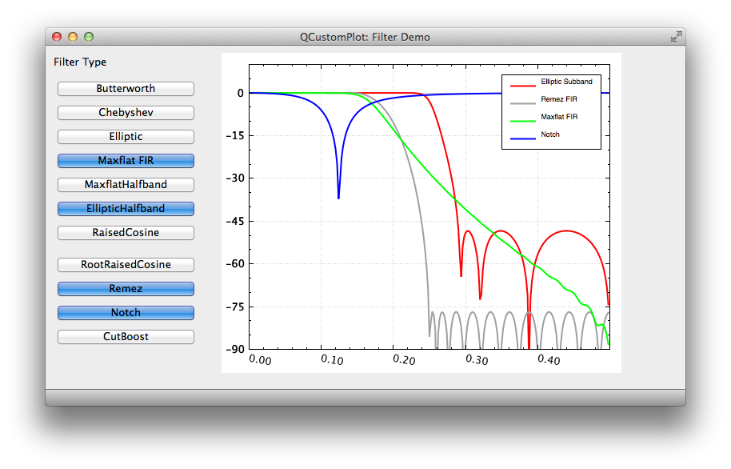

SPUC - Signal Processing Using C++
================================================================================

### Build status - Mac Os X, clang
[](https://travis-ci.org/audiofilter/spuc)

This is an update of code that has been on sourceforge for about 14 years. The genesis of this code goes back even further - before decent C++ template support and availability of a useful complex class.

**Most of the filtering code reqired here is now from spuce library rather than inherent to this library**
**Also most files now use MIT License (check each file)**

**To install via Homebrew**
* brew tap audiofilter/spuc
* brew install spuce
* brew install spuc  (or brew install -HEAD spuc for latest sources (unstable)

Library documentation pages here : http://audiofilter.github.io/spuc/

----
### Various Sub-projects also on Github

SPUC_FIXED - Fixed point class similiar to SystemC
[](https://travis-ci.org/audiofilter/spuc_fixed)

SPUCE - Update of spuc. At this point FIRs,IIRs and Windows supported. Includes QT Examples
[](https://travis-ci.org/audiofilter/spuce)

----

### Background Info

Since the code on sourceforge, has not compiled for modern compilers for several years, this update fixes compiler errors and other bugs found in more real-life testing. Also various parts have been updated/upgraded.

For now this is merely an update and is lacking in other documentation and / or examples.

In addition to very very basic examples, there are some in graphic_examples that can be compiled and display data using OpenGL
For this purpose the cpplot project files are added as a subdirectory.
This should work fine on a Mac if you have Boost installed.
The examples display impulse responses for various filters.
There is also an example that display BER for an MLSE Equalizer as noise is added to the input.

Travis is being used to display the build integrity and uses Clang on Mac OSX 10.9. However, this should also work fine with GCC 4.8

----


### Information (details on http://audiofilter.github.io/spuc/ )

SPUC was originally written since early C++ had no complex class as part of a standard. In addition we needed a complex class to support handling fixed-point data types to model real hardware in digital communication ASICs.
After that many filtering classes and functions were added. This allowed trading off stopband and cut-off without having to go to Matlab to recalculate coefficients. So of the filter types supported are (now in spuce)

* Butterworth
* Chebyshev
* Elliptic
* Maximally flat FIR
* Remez Equiripple
* Raised Cosine FIR
* Gaussian FIR
* CIC
* Notch filter
* Cut/Boost Filter
* Halfband/Subband IIR filters
	   
Digital Filter types are either FIR or IIR Filters. To separate filter design from filter usage, there are typically different classes involved rather than putting everything into one class.

Thus there is 

* a FIR coefficient class and an IIR coefficient class
* Separate functions that calculate coefficients for the Classic IIR Filters:
	* Butterworth
	* Chebyshev			
	* Elliptic
* Separate functions that calculate coefficients for the various FIR Filters as noted above

Then typically separate classes that can implement these filters

* For IIR filters design can be broken down to biquad sections which is what is typically used in hard-ware

In addition to digital filtering this library handles resampling using

* Polyphase filtering approach
* Cascaded Integrate Comb filters (or CIC filters)
* Irrational resampling with Farrow & Lagrange based filters

================================================================================

#### Equalizers

* FIR Adaptive filters
	* FIR only
	* FIR with Decision Feedback Estimator

* Recursive Least Squares Estimator

* Maximum Likelihood Sequence Estimators
	* MLSD
	* DDFSE
	* RSDFSE

================================================================================

#### Digital Communication Building Blocks

* Phase lock loops + various discriminators
	* For carrier frequency acquistion and tracking
	* For Symbol timing synchronization

* Cordic processor
* QPSK, QAM Single Carrier Modulators/Demodulators
* OFDM 
* Convolutional Encoder + Viterbi Decoder

* Fading Channel


----
### Examples - QPSK BER Simulation for various SNR ratios in AWGN


----
### A QT App for filter design - Use mouse to shape filters 

http://github.com/audiofilter/spuc_filter




-----
### Requirements
* cmake
* boost for graphic examples 

### Building

```sh
# First spuce
git clone https://github.com/audiofilter/spuce.git
cd spuce
mkdir build
cd build
cmake ..
make install
# Now spuc
cd ../..
mkdir build
cd build
cmake ..
make
```

Extra switches to CMake enable the various examples to be built


* SPUC_BUILD_ALL - Build everything
* SPUC_EXAMPLES - Build the examples
* SPUC_GRAPHICS - Build the examples that requires gl,opengl, etc
